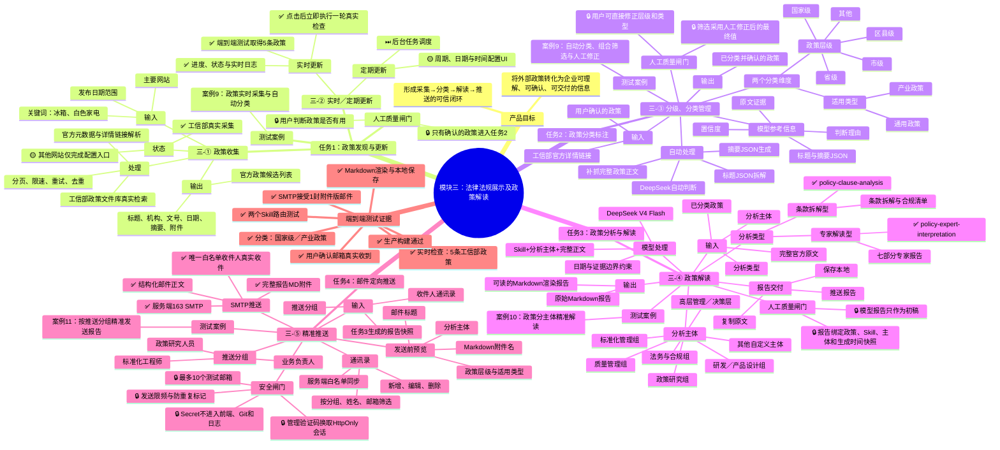
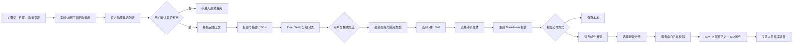

# 模块三：法律法规展示及政策解读——思维导图整理

## 一、思维导图优化结论

现有思维导图已经覆盖企业需求的五条主线，但建议进一步调整为“需求—任务—状态—案例”四层结构。

主要优化点：

1. 将“政策收集”和“实时／定期更新”拆成两个需求节点，但在产品中归入同一个任务页面。
2. 补充任务之间的数据流转，说明上一任务的什么结果会进入下一任务。
3. 每个任务同时标注输入、核心处理、输出、人工确认点和测试案例。
4. 使用统一状态标识，避免“UI 已配置”和“真实功能已跑通”混在一起。
5. 将案例 9—11直接挂到对应任务下，让评委能够从需求快速定位到演示证据。
6. 增加贯穿全流程的可信度与安全机制，包括官方来源、人工筛选、人工修正、报告快照和邮件白名单。

### 状态图例

- ✅ 已真实接通并完成测试
- 🟡 Demo 已具备，存在明确范围边界
- ⏭ 可选后续能力，不属于本轮验收
- 🔒 可信度、安全或人工质量闸门

---

## 二、完善后的 Mermaid 思维导图

---

## 三、Markdown 层级大纲

下面的层级结构可以作为思维导图工具的导入底稿。

- 模块三：法律法规展示及政策解读
  - 产品目标
    - 从可信来源发现政策
    - 判断政策与产业的相关性
    - 形成面向具体主体的政策解读
    - 将报告准确交付给关注人员
  - 任务1：政策发现与更新
    - 三-① 政策收集
      - 输入
        - 关键词
        - 发布日期范围
        - 主要网站
      - 当前能力
        - 工信部政策文件库真实采集
        - 分页、限速、重试和去重
        - 标题、机构、文号、发布日期、摘要、官方链接和附件解析
      - Demo 边界
        - 其他网站只有配置入口
        - 本轮不宣称已经接入其他网站爬虫
    - 三-② 实时／定期更新
      - 实时更新
        - 选择实时更新
        - 点击开始实时检查
        - 立即访问工信部政策库
        - 展示进度、日志和采集结果
      - 定期更新
        - 已完成周期、日期和时间配置 UI
        - 后台定时调度后续接入
    - 人工确认
      - 用户勾选有用政策
      - 用户确认后进入任务2
    - 对应案例
      - 案例9
  - 任务2：政策分类标注
    - 三-③ 分级、分类管理
      - 输入
        - 用户确认的政策
      - 自动处理
        - 补抓完整正文
        - 标题 JSON 拆解
        - 内容摘要 JSON
        - DeepSeek 自动分类
      - 政策层级
        - 国家级
        - 省级
        - 市级
        - 区县级
        - 其他
      - 适用类型
        - 通用政策
        - 产业政策
      - 模型依据
        - 置信度
        - 判断理由
        - 原文证据
        - 标题与摘要 JSON
      - 人工调整
        - 用户直接修改模型分类
        - 筛选结果按最终值同步
      - 输出
        - 已分类政策
    - 对应案例
      - 案例9
  - 任务3：政策分析与解读
    - 三-④ 政策解读
      - 输入
        - 已分类政策
        - 完整官方原文
        - 分析类型
        - 分析主体
      - 专家解读型
        - policy-expert-interpretation
        - 政策背景
        - 政策目标
        - 核心内容
        - 行业影响
        - 企业核心要点
        - 行动建议
        - 风险提示
      - 条款拆解型
        - policy-clause-analysis
        - 政策概览
        - 条款拆解
        - 合规清单
        - 风险提示
      - 分析主体
        - 六个预置主体
        - 其他自定义主体
      - 输出
        - Markdown 排版预览
        - Markdown 原文
        - 复制报告
        - 保存本地
        - 推送报告
    - 对应案例
      - 案例10
  - 任务4：邮件定向推送
    - 三-⑤ 精准推送
      - 输入
        - 任务3报告快照
        - 推送分组
        - 联系人姓名和邮箱
      - 通讯录
        - 筛选
        - 新增
        - 编辑
        - 删除
      - 邮件内容预览
        - 标题
        - 正文信息
        - Markdown 附件
      - SMTP 真实推送
        - 仅发送给所选分组
        - 完整报告作为 MD 附件
        - SMTP 返回接受状态
      - 安全机制
        - 服务端 Secret
        - 管理验证码
        - HttpOnly 会话
        - 收件人白名单
        - 最多 10 个邮箱
        - 发送限频
        - 防重复投递
    - 对应案例
      - 案例11
  - 测试证据
    - 案例9
      - 冰箱、白色家电
      - 2020-01-01 至 2026-08-15
      - 实时检查取得 5 条工信部政策
      - 自动分类、组合筛选和人工修正
    - 案例10
      - 2022 年节能技术装备产品推荐政策
      - 专家解读型
      - 分析主体：业务负责人
      - 两个 Skill 路由正常
      - Markdown 渲染、复制、保存和推送
    - 案例11
      - 只选择业务负责人分组
      - 服务端唯一白名单收件人
      - SMTP 接受 1 封邮件
      - 邮件正文结构清晰
      - 完整报告作为 Markdown 附件
      - 用户确认真实收到

---

## 四、需求覆盖矩阵

| 企业需求 | 产品任务 | 当前实现 | 测试证据 | Demo 边界 |
| --- | --- | --- | --- | --- |
| 三-① 政策收集 | 任务1 | 关键词、日期、来源配置；工信部官方真实采集 | 案例9、爬虫测试、UI 端到端测试 | 其他网站只有配置入口 |
| 三-② 实时／定期更新 | 任务1 | 实时模式立即执行真实检查；定期模式支持周期和时间配置 | `test:realtime` 取得5条政策 | 持续轮询和后台定时调度尚未接入 |
| 三-③ 分级、分类管理 | 任务2 | 标题／摘要 JSON、DeepSeek 自动分类、人工修正、层级与类型组合筛选 | 案例9、分类器测试、UI 测试 | 当前只验收企业要求中的两个分类维度 |
| 三-④ 政策解读 | 任务3 | 两个项目内 Skill、分析主体、完整正文、Markdown 报告、复制、保存与推送 | 案例10、Skill 路由测试、Markdown 测试 | 模型结论仍需业务人员复核 |
| 三-⑤ 精准推送 | 任务4 | 推送分组、通讯录、邮件预览、SMTP 正文与 Markdown 附件 | 案例11、SMTP 真实投递、用户确认收件 | 当前推送渠道为邮件 |

---

## 五、端到端数据流

### 五个质量闸门

1. **来源闸门**：真实结果必须来自工信部官方政策文件库。
2. **相关性闸门**：只有用户确认有用的政策才能进入分类。
3. **分类闸门**：模型标签只是参考，用户可以人工修正。
4. **报告闸门**：报告绑定政策、Skill、分析主体和生成时间快照。
5. **发送闸门**：服务端管理会话、收件人白名单和限频全部通过后才能发送。

---

## 六、开发与测试回顾

### 1. 已真实跑通的能力

- 工信部政策文件库真实采集。
- 冰箱、白色家电关键词和日期范围检索。
- 实时检查模式及过程日志。
- 用户筛选政策并流转至分类页。
- 完整正文补抓、标题 JSON 和摘要 JSON。
- DeepSeek 自动判断政策层级与适用类型。
- 分类人工修正和组合筛选。
- 专家解读型与条款拆解型 Skill。
- 分析主体与自定义主体进入模型上下文。
- Markdown 报告渲染、复制和本地保存。
- 任务3报告快照流转到任务4。
- 通讯录增删改查和分组选择。
- 163 SMTP 真实邮件发送。
- 结构化邮件正文和 Markdown 报告附件。
- 用户确认真实邮箱收到附件版邮件。

### 2. 关键真实测试结果

| 测试 | 结果 |
| --- | --- |
| 实时更新 Demo | 进度100%，取得5条工信部官方政策，实时日志存在，无横向溢出 |
| 政策分类 | 示例政策被判断为国家级、产业政策，支持人工调整 |
| Skill 路由 | 专家解读型、条款拆解型各调用1次，路径与输出均正确 |
| 分析主体 | 模型请求包含所选主体，报告按主体组织重点 |
| Markdown | 标题、列表、表格和引用正常渲染，同时保留原始 Markdown |
| 保存本地 | 支持路径选择；不支持时降级浏览器下载 |
| SMTP 健康检查 | SMTP 已配置、身份验证通过、白名单收件人数量为1 |
| SMTP 附件投递 | 服务器接受1封邮件，完整报告作为 `.md` 附件 |
| 邮箱验收 | 用户确认收到结构化正文和 Markdown 附件 |
| 安全扫描 | 发件账号、授权码、真实收件邮箱和管理验证码在源码中零泄露 |
| 生产构建 | TypeScript 与 Vite 构建通过 |

### 3. 当前 Demo 边界

- 工信部是本轮唯一真实政策来源；其他网站入口用于表达可扩展性。
- 实时更新是“立即执行一轮真实检查”，不是后台持续轮询。
- 定期更新已完成配置 UI，尚未创建后台调度任务。
- 当前正式推送渠道为 SMTP 邮件。
- 模型分类和报告是辅助结果，用户保留最终修正与确认权。

这些边界与企业原始三-①至三-⑤需求保持一致，不把飞书、企业内部数据库或版本管理等未明确要求的扩展能力写入本轮验收。

---

## 七、建议演示顺序

1. **说明目标**：模块三不是单纯政策列表，而是政策发现到精准交付的闭环。
2. **演示案例9**：输入“冰箱、白色家电”，选择实时更新，真实取得工信部政策。
3. **展示人工筛选**：勾选有用政策，确认进入分类。
4. **展示自动分类**：查看层级、类型、模型依据和 JSON，并人工修改一个标签。
5. **演示案例10**：选择专家解读型和业务负责人，生成并渲染报告。
6. **展示报告交付**：演示复制、保存本地和推送报告。
7. **演示案例11**：任务4自动显示报告，选择业务负责人分组并核对邮件预览。
8. **展示真实结果**：打开测试邮箱，展示邮件正文和 Markdown 附件。
9. **说明安全边界**：SMTP 凭据只在服务端 Secret，发送受白名单和限频保护。
10. **说明 Demo 边界**：其他来源和后台定时调度是可扩展项，不冒充已完成能力。

---

## 八、一句话总结

模块三已经完成一条可真实演示的闭环：**从工信部官方政策库实时发现与冰箱行业相关的政策，经人工筛选、AI 自动分类、指定 Skill 和分析主体生成可复核报告，再通过受控 SMTP 将 Markdown 报告精准发送给对应业务负责人。**
